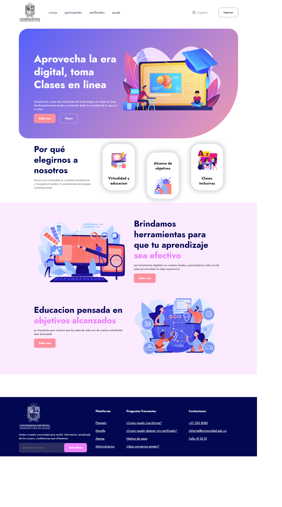

<h1>Taller 9 - Micahel Restrepo Lache</h1>
<h2>Informacion</h2>

Curso: FullStack Basico - Grupo 1

Profesor: Cristian Felipe Patiño Caseres

<h2>Link de la pagina web</h>
<a href="https://gitprogramaer.github.io/taller-9-full-stack/">link pagina web</a>

<h2>link de Figma</h2>
<a href="https://www.figma.com/file/HuEK4GQCgMpasT2uSAXz56/Michael-Restrepo-Lache?type=design&node-id=0%3A1&mode=design&t=U2XOzpjCE2xRzfjk-1">link de figma</a>

<h2>Punto 2: Diseño de HTML</h2>
<h2>Punto 3: Diseño de CSS</h2>

<h2>Punto 4: Titulos</h2>
<h2>Punto 5: Parrafo</h2>
<h2>Punto 6: Links</h2>
<h2>Punto 7 y 8: Navegacion</h2>
<h2>Punto 9: Tablas</h2>